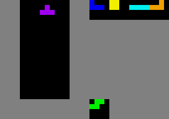
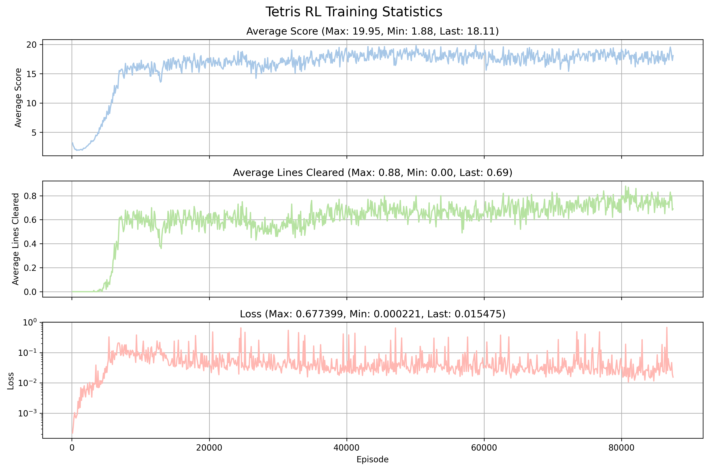

# Training an end-to-end Tetris Agent with DDQN



*Sample gameplay of an end-to-end trained agent playing tetris.*



*Training statistics of the agent.*

## Getting started

### Trying it out

The easiest way to see the model in action is to check out the pre-recorded gifs of the agent playing Tetris. You can find them in the `gifs` directoy. The gifs are names with the training step of the agent at which they're recorded.

Once you clone/download the repository, run the following to replicate training. Note that `uv` handles dependency installation, so you don't need to install any dependencies manually. If you do not have `uv`, consult [this guide](https://docs.astral.sh/uv/getting-started/installation/) or run `wget -qO- https://astral.sh/uv/install.sh | sh` if you're on a Unix system.

```bash
uv run train_dqn.py
```

Training takes significant time (on a server-grade GPU, this ranges from couple of hours to 1 day), so if you just want to try the model out, you can run the following to load a pre-trained model and play a game of Tetris:

```bash
uv run test_dqn.py --gif
```

Using `--gif` will save a gameplay by the agent to `gifs/test_episode.gif`. Or, you can use `--ansi` option to print out gameplays and evaluation statistics to the terminal. Note that the evaluation script uses the default reward function, which is different from the one used in training, so the scores may not be comparable. The model I trained is uploaded in the `final_checkpoints` directory, and is used as the default model checkpoint to evaluate in the test script.

### Directory Structure

```
Tetris-RL/
├── gifs/ # pre-recorded gifs
├── logs/ # training logs
├── final_checkpoints/ # final model checkpoints
├── dqn_agent.py # DQN & agent class implementation
├── train_dqn.py # training script
├── test_dqn.py # testing script that loads a model and plays a game
├── visualize_logs.py # script to visualize training logs
├── train.sh # bash script to run training with SLURM
├── pyproject.toml # uv project file
├── uv.lock # uv lock file
```

## Env & Setup

There are many attempts at training Tetris-playing agents (like [this](https://github.com/vietnh1009/Tetris-deep-Q-learning-pytorch/tree/master), or [this](https://cs231n.stanford.edu/reports/2016/pdfs/121_Report.pdf)). The key observation is that training on raw observations --- just what the human sees --- does not work. Projects that demonstrate impressive results are usually a comnbination of sophisticated feature engineering, search (e.g. MCTS), and/or action grouping. The starting goal of this project is to explore how far we could get with none of the above, with only a basic model-free RL algorithm. The key characteristics of the setup are follows:

- end-to-end: unlike common RL tetris agents, the model receives the board state as input and has to produce an action as output. There are no human-enginerred features or action grouping.
- full-fledged tetris: the agent has access the the entire action space, including hard drop and holding etc.

Implementationally, the following are also important:

- vector envs: I used multiple parallel environments to speed up rollouts during training
- replay buffer: Instead of generating all training samples on the fly, I implemented a replay buffer, which is standard in DQN training. The buffer stores past samples and gradually updates them, and training batches are sampled from the buffer as opposed to simulated. 
- logging: I implemented a minimal logger that saves key training stats as a csv file, which is later used for visualization

## Model

The model I'm training is a simple neural network. Since the model receives a board state as input, which is visual information, the model is a 3-layer CNN followed by a 3-layer MLP. See `dqn_agent.py` for details.

I initially tried training the model with DQN, which optimizes for the Bellman equation loss

$$Q(s, a) = r + \gamma \max_{a'} Q(s', a')$$

where $s$ is the current state, $a$ is the action taken, $r$ is the reward received, and $s'$ is the next state. $Q$ is given by the neural network approximator, with the state as input. However, DQN does not converge well in practice --- the model platforms in reward quickly and performance stops improving. I ended up using Double DQN (DDQN), which uses a target network to stabilize training. Instead of using the same network to compute Q and target value, DDQN uses a copy of the network that updates once very few steps. Additionally, I implemented updates with a soft update rule:

$$ Q_{target}(s, a) \leftarrow \tau Q(s, a) + (1 - \tau) Q_{target}(s, a) $$

where $\tau$ is a hyperparameter that controls the update rate. The target value is computed as:

$$Q_{target}(s, a) = r + \gamma Q_{target}(s', \arg\max_{a'} Q(s', a'))$$

where the action $a'$ that maximizes the Q-value is computed using the main network, but the Q-value itself is computed using the target network. This logic is implemented in `train` method of `dqn_agent.py`.

## Important Hyperparameters

Running a full training takes ~20h on a V100 GPU. Due to the computational cost, I did not do a full-fledged hyperparameter search (which would require running full-length experiments). Instead, I heuristically tried the below combinations and settled on the ones that seems to work best during early training.

- Reward function: the reward function turns out the be the most important factor: balancing reward values for different outcomes encourages drastically different behaviors. Crucially, if the reward of dropping pieces is too high compared to the reward for staying alive, the model quickly learns to "suicide" by hard-dropping pieces and ending the game early, and does not escape from the strategy. 
    - Game over: `-1`
    - Line clear: `1`
    - Piece drop: `0.05`
    - Staying alive: `0.05`  
- Replay Buffer size
    - `100000`
- Model size
    - 2 hidden layers, each of 128, ReLU activation
- Learning rate
    - `2e-3`, after trying `1e-4`, `5e-3`, and `1e-2`
- Batch size
    - `256`, after trying `32`, `128`, and `512`
- Epsilon decay
    - `0.9999`, after trying `0.999`, `0.99999`, and `0.999999`. Epsilon starts at `1.0` and decays to `0.05` over the course of training.
- $\tau$ for target network update
    - `0.005`
- Update frequency
    - `2`, after trying `1`, `2`, and `4` 

## Results & Observations

We see that with the above setup, the model significantly outperforms a random policy, and certainly "learns" to play Tetris in some important sense: for example, it often is *able* to clear a line, and knows, to some extent, to avoid the board filling up and use/release blocks in hold. However, it clearly hasn't really grasped the core idea of the game: continuously clearing lines. It often succeeds at clearing the first line, but performance seems to degrade as gameplay goes on, suggesting that there is still a bootstrapping problem. Furthermore, the model quickly dies at the end and training reward plateaus mid-training, suggesting that DDQN with the current setup is not enough to learn the game.